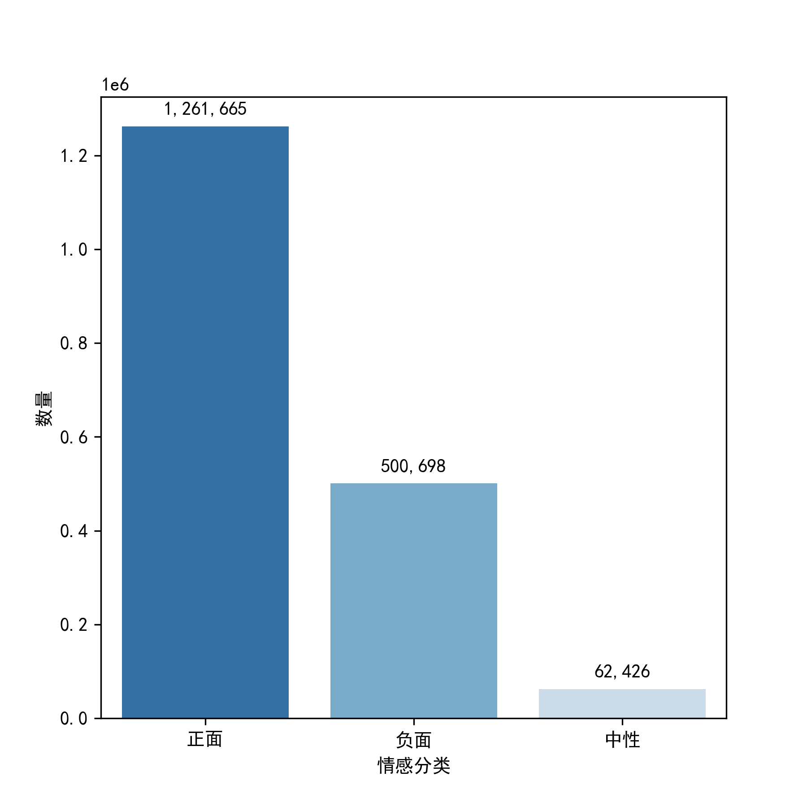
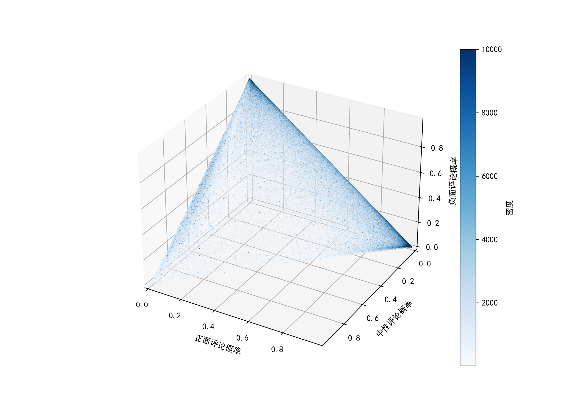
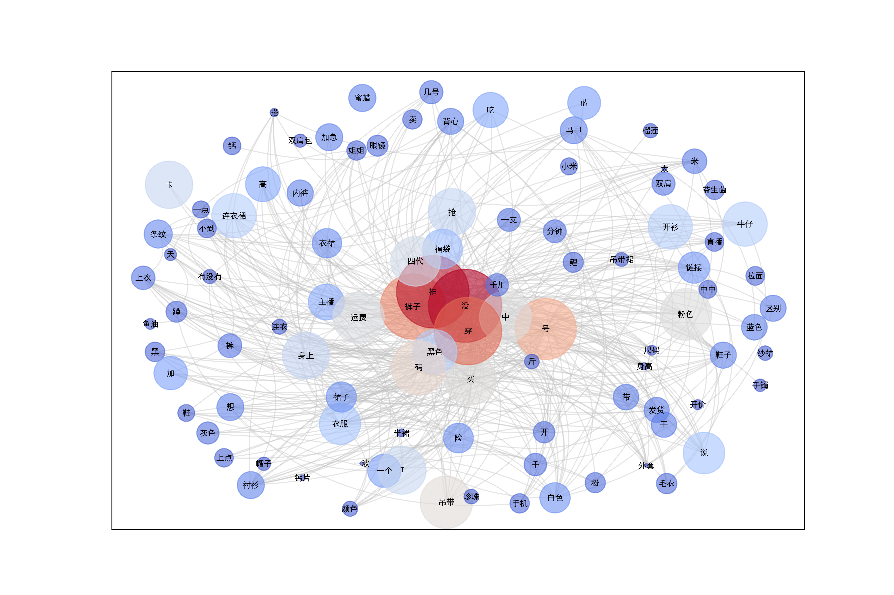

# 抖音实时GMVTop5 直播间评论抓取与情感分析

### 声明：
本项目的代码和文档仅供学习和研究目的使用。严格禁止将此项目用于包括但不限于商业盈利、破坏系统完整性、非法获取个人信息等违法违规行为。任何因不遵守此声明而导致的法律和道德后果均由使用者自行承担。

特别说明，此项目的所有API调用、爬虫使用的Token和Cookies均为作者个人资产，与项目共享的代码中将进行必要的隐私保护处理。
本项目为作者闲的蛋疼所为，对代码的稳定性、准确性不保证。
> Sun,Weilin(Cookiezi)

> 2024年4月25日


### 环境：
- windows 11
- python 3.7+
- aliyun_python_sdk_alinlp==1.0.20
- aliyun_python_sdk_core==2.15.0
- beautifulsoup4==4.12.3
- betterproto==1.2.5
- lxml==5.1.0
- Requests==2.31.0
- websocket_client==1.7.0

### 结构说明：
- Analysis_Documents：数据分析后图片存储位置
- Collected_Data：爬虫数据收集存放地
- Cores：直播间评论抓取控制代码
- Model_Train：情感分析模型模块
- Protobuf：抓包配置文件等
- Spiders：抓包配置文件

### 使用说明

#### 抓包部分

> 进入main.py，配置函数变量，一键运行。变量说明如下：


| 变量名            | 说明        | 默认值 |
|----------------|-----------|-----|
| sustain_days   | 项目总持续天数   | 0   |
| sustain_hours  | 项目总持续小时数  | 0   |
| sustain_minutes | 项目总持续分钟数  | 0   |
| sustain_seconds | 项目总持续秒数   | 0   |
| single_capture_days   | 单次抓包持续天数  | 0   |
| single_capture_hours   | 单次抓包持续小时数 | 0   |
| single_capture_minutes   | 单次抓包持续分钟数 | 0   |
| single_capture_seconds   | 单次抓包持续天秒数 | 0   |
| brush_threshold   | 判定刷屏阈值    | 10  |

- 于Spiders.GetLiveID.py 19行配置bing搜索cookies
- 于Spiders.Login.py 24、67行配置灰豚数据网账号密码
- 于Cores.CoreFunc.py 22行配置阿里Api密钥
- 于Cores.SentimentAnalysis.py 10行配置阿里Api密钥

> - 在进行弹幕数据包捕获与解析的初步阶段，若遭遇以下述错误消息，此现象表明对于「room_id」的解析尝试，借助Bing搜索引擎而未能成功执行。对于此类情况，无需过度关注。该错误仅示意在首批五个关键带货直播间中，存在部分直播间无法通过Bing搜索引擎被准确检索到。
```
Exception in thread Thread-5 (target_function_4):
Traceback (most recent call last):
  File "D:\python\Lib\threading.py", line 1073, in _bootstrap_inner
    self.run()
  File "D:\python\Lib\threading.py", line 1010, in run
    self._target(*self._args, **self._kwargs)
  File "C:\Users\12748\Desktop\GraduateProjectCode\Cores\CoreFunc.py", line 104, in target_function_4
    DouyinLiveWebFetcher(live_id_list[4]).start()
  File "C:\Users\12748\Desktop\GraduateProjectCode\Spiders\LiveConetnts.py", line 61, in start
    self._connectWebSocket()
  File "C:\Users\12748\Desktop\GraduateProjectCode\Spiders\LiveConetnts.py", line 123, in _connectWebSocket
    f"&internal_ext=internal_src:dim|wss_push_room_id:{self.room_id}|wss_push_did:{self.room_id}" \
                                                       ^^^^^^^^^^^^
  File "C:\Users\12748\Desktop\GraduateProjectCode\Spiders\LiveConetnts.py", line 112, in room_id
    self.__room_id = match.group(1)
                     ^^^^^^^^^^^
AttributeError: 'NoneType' object has no attribute 'group'
```

#### 模型部分

bert模型放在 bert_pretain目录下，ERNIE模型放在ERNIE_pretrain目录下，每个目录下都是三个文件：
 - pytorch_model.bin  
 - bert_config.json  
 - vocab.txt

预训练模型下载地址：  
bert_Chinese: 模型 https://s3.amazonaws.com/models.huggingface.co/bert/bert-base-chinese.tar.gz  
              词表 https://s3.amazonaws.com/models.huggingface.co/bert/bert-base-chinese-vocab.txt  
来自[这里](https://github.com/huggingface/pytorch-transformers)

ERNIE_Chinese: http://image.nghuyong.top/ERNIE.zip  
来自[这里](https://github.com/nghuyong/ERNIE-Pytorch)  

为什么训练了模型但是仍然使用阿里API?因为打标数据太少且文本较短，实际效果不如直接调用阿里APL

解压后，按照上面说的放在对应目录下，文件名称确认无误即可。  

训练并测试：
python run.py --model xxx

### 实现路径

- **灰豚网数据抓取**：实现对灰豚网的自动登录，抓取实时直播带货榜单信息。
- **直播间名称获取**：从抓取的数据中解析出当前GMV排名前5的直播间名称。
- **利用搜索引擎定位直播间**：通过构建查询，使用Bing搜索引擎查找直播间确切位置，进而解析获取room_id。
- **并行抓取任务管理**：使用Python的threading模块创建并管理多个弹幕抓取任务，实现对多个直播间的同时监控。
- **WebSocket连接建立**：对指定直播间建立WebSocket连接，实时抓取弹幕数据。
- **弹幕数据解析**：使用自定义的protobuf协议对抓取的二进制数据进行解析，提取出弹幕文本。
- **数据预处理**：对抓取的弹幕内容进行清洗，去除广告和无意义内容，提高数据质量。
- **文本情感分析**：对清洗后的弹幕文本调用阿里云情感分析API，获取情感倾向（正面、中性、负面）及对应概率。
- **结果分类与记录**：根据情感分析结果，将弹幕文本分类，并记录到不同的数据集中，如正面弹幕集、负面弹幕集等。
- **EXTRA:简单数据分析**：对于收集的数据进行简单的数据分析，包括描述性统计与应用TF-IDF的LDA主题模型建立。
- **EXTRA:情感分类深度学习模型**：因为阿里的情感分析结果有些许扯淡，因此手动打标一部分数据并试图进行几种情感分类模型的建立与初步调优。


### 输出样例
> 以10s总运行时长，5s为单次并行抓包为例：
```text
D:\python\python.exe C:\Users\12748\Desktop\GraduateProjectCode\main.py 
2024-03-10 22:44:28.267315 项目开始运行
2024-03-10 22:44:28.267315 项目设定总运行时长为: 0:00:20
2024-03-10 22:44:28.267315 项目设定终止时间: 2024-03-10 22:44:48.267315
2024-03-10 22:44:28.267315 项目设定单次并行抓包运行时长为: 0:00:05
2024-03-10 22:44:28.267315 项目子程序循环运行第 1 次
2024-03-10 22:44:34.799269 主播房间名称: 温博士美妆旗舰店 主播排名: 1 类目: ['美妆个护']
2024-03-10 22:44:34.799269 主播房间名称: 与辉同行 主播排名: 2 类目: ['日用百货']
2024-03-10 22:44:34.799269 主播房间名称: 董先生-10号上午11点源头珠宝市场批发 主播排名: 3 类目: ['珠宝文玩']
2024-03-10 22:44:34.799269 主播房间名称: BooZier个人防护旗舰店 主播排名: 4 类目: ['日用百货']
2024-03-10 22:44:34.799269 主播房间名称: 安然美妆- 黛安蒂护肤品牌创始人 主播排名: 5 类目: ['美妆个护']
2024-03-10 22:44:35.916392 为防止bing站点封禁，随机停机，本次停机 1 秒
2024-03-10 22:44:36.917429 重定向链接解析直播间 1 成功;Live_id为 355021666331
2024-03-10 22:44:38.118756 为防止bing站点封禁，随机停机，本次停机 4 秒
2024-03-10 22:44:42.119048 重定向链接解析直播间 2 成功;Live_id为 646454278948
2024-03-10 22:44:43.159851 为防止bing站点封禁，随机停机，本次停机 3 秒
2024-03-10 22:44:47.281653 为防止bing站点封禁，随机停机，本次停机 5 秒
2024-03-10 22:44:52.282305 重定向链接解析直播间 3 成功;Live_id为 693271917737
2024-03-10 22:44:53.555426 为防止bing站点封禁，随机停机，本次停机 0 秒
2024-03-10 22:44:53.555426 重定向链接解析直播间 4 成功;Live_id为 425123868541
2024-03-10 22:44:56.532305 抓包解析出弹幕内容为: [赞][赞][赞][赞][赞][赞][赞][赞]
2024-03-10 22:44:56.533305 抓包解析出弹幕内容为: 蓝色没了
2024-03-10 22:44:56.536270 抓包解析出弹幕内容为: 可以打电话么
···
···
···
2024-03-10 22:44:58.544884 抓包解析出弹幕内容为: 讲的真详细
2024-03-10 22:44:58.546880 抓包解析出弹幕内容为: 鹏鹏 董董，讲得真好
2024-03-10 22:44:58.548872 抓包解析出弹幕内容为: 1199手机还有[爱心][爱心]
2024-03-10 22:44:58.549872 抓包解析出弹幕内容为: 耳机真好用
2024-03-10 22:44:58.551836 抓包解析出弹幕内容为: 华为汽车有链接不
2024-03-10 22:44:58.559939 线程37372已被终止
2024-03-10 22:44:58.559939 线程35952已被终止
2024-03-10 22:44:58.559939 线程37108已被终止
2024-03-10 22:44:58.559939 抓包数据解析中...
2024-03-10 22:44:59.247102 抓包数据解析成功
2024-03-10 22:44:59.247102 本轮共收集评论数: 50 待刷屏解析
2024-03-10 22:44:59.248100 清理刷屏内容后的评论数为: 50
2024-03-10 22:44:59.929576 评论:' [赞][赞][赞][赞][赞][赞][赞][赞] '解析状态: success 结果如下:
2024-03-10 22:44:59.929576 情感极性: 正面 ; Positive概率: 0.9995 ; Neutral概率: 0.0 ; Negative概率: 0.0005 ;
2024-03-10 22:45:00.066216 评论:' 蓝色没了 '解析状态: success 结果如下:
2024-03-10 22:45:00.066216 情感极性: 正面 ; Positive概率: 0.5901 ; Neutral概率: 0.023 ; Negative概率: 0.3865 ;
···
···
···
2024-03-10 22:45:04.762531 评论:' 1199手机还有[爱心][爱心] '解析状态: success 结果如下:
2024-03-10 22:45:04.762531 情感极性: 正面 ; Positive概率: 0.9453 ; Neutral概率: 0.0085 ; Negative概率: 0.0461 ;
2024-03-10 22:45:04.864380 评论:' 耳机真好用 '解析状态: success 结果如下:
2024-03-10 22:45:04.864380 情感极性: 正面 ; Positive概率: 0.9404 ; Neutral概率: 0.0051 ; Negative概率: 0.0545 ;
2024-03-10 22:45:04.865253 项目子程序第 1 次运行成功，本次运行时长: 0:00:36.597938
2024-03-10 22:45:04.865253 预设运行时间已达成，共运行子程序 2 次
2024-03-10 22:45:04.865253 预设结束时间: 2024-03-10 22:44:48.267315 总程序运行时间: 0:00:36.597938
2024-03-10 22:45:04.866250 请回收数据进行分析

```
### 数据分析结果

->正面、负面、中性评论分布：


->正面、负面、中性评论倾向分数分布：


->词语共现关系图：


···更多分析于Data_Ananlysis.ipynb中展现

### 情感分类模型效果

| 模型       | Acc   | 负面Pre | 负面Rec | 负面F1 |
|-----------|-------|---------|---------|--------|
| TextCNN   | 91.6% | 90.1%   | 93.1%   | 91.6%  |
| TextRCNN  | 90.6% | 91.9%   | 89.4%   | 90.6%  |
| Transformer | 89.2% | 90.0%   | 91.2%   | 90.6%  |
| TextRNN   | 89.2% | 93.9%   | 85.7%   | 89.6%  |
| TextRNN_Att | 89.6% | 90.5%   | 88.4%   | 89.5%  |
| FastText  | 88.6% | 84.4%   | 92.6%   | 88.3%  |
| DPCNN     | 87.6% | 92.8%   | 83.8%   | 88.1%  |
| Bert      | 76.2% | 93.7%   | 61.6%   | 74.3%  |
